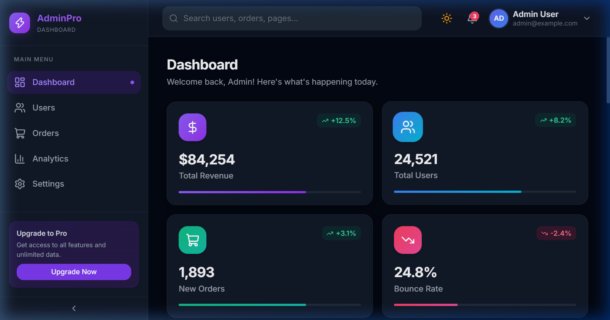
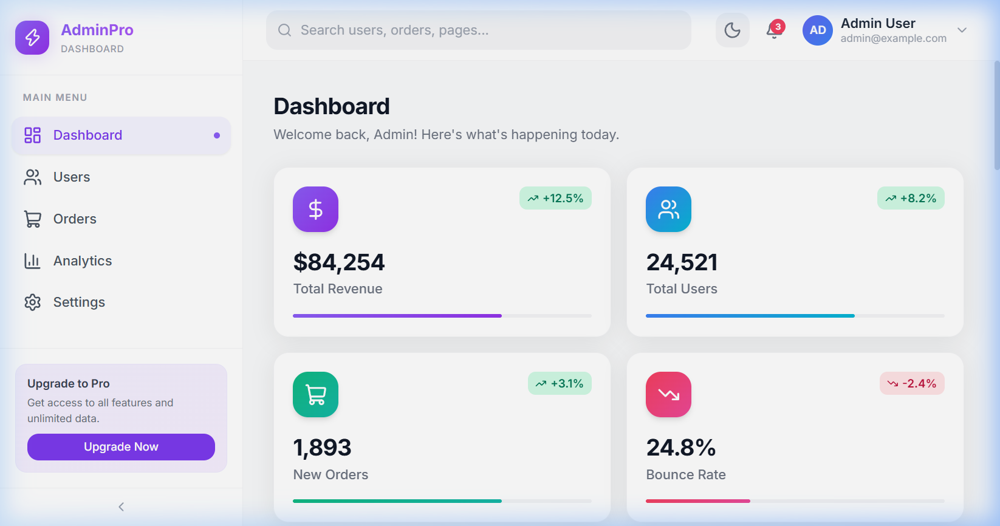
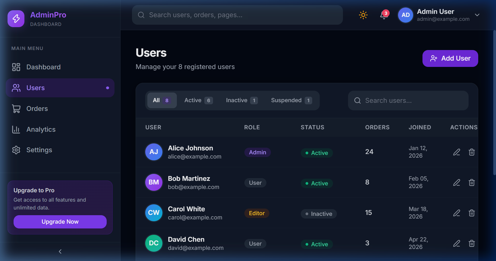
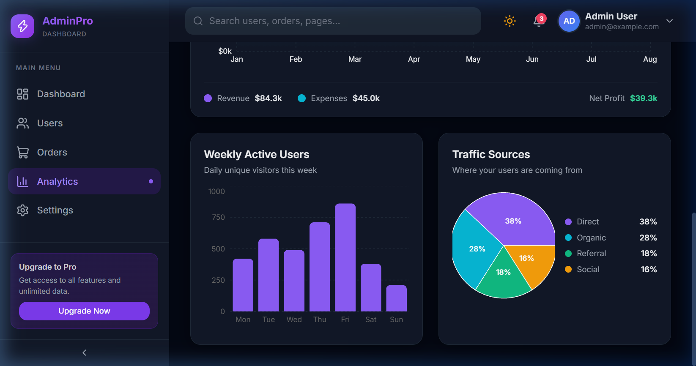

# AdminPro – React Admin Dashboard

A modern, production-quality SaaS Admin Dashboard built with **React + Vite + Tailwind CSS**.



## 🚀 Live Demo

[Coming soon — deploy to Vercel/Netlify]

## ✨ Features

- 🌙 **Dark / Light Mode** — Toggle with persistence via localStorage
- 📱 **Fully Responsive** — Mobile-first layout (375px → 1440px)
- 🗂️ **Collapsible Sidebar** — Desktop collapse + mobile overlay drawer
- 🔍 **Global Search Bar** — Connected to global state via Context
- 🔔 **Notifications Panel** — Unread badge, mark-read, dropdown
- 📊 **Charts** — Area + Bar + Pie charts via Recharts
- 📋 **Sortable Tables** — Multi-column sorting on orders/users
- 🧩 **Reusable Components** — Badge, Button, Avatar, SearchBar
- 🎨 **Smooth Animations** — Fade-in, slide-in, bounce-in, hover lifts
- 🧭 **React Router v6** — 5 pages with client-side navigation

## 📄 Pages

| Page | Description |
|------|-------------|
| **Dashboard** | Stats cards, revenue chart, orders table, activity feed, user profile, quick insights |
| **Users** | User management table with search + status filters + edit/delete |
| **Orders** | Orders table with status filters + summary cards |
| **Analytics** | KPI cards, weekly users bar chart, traffic sources pie chart |
| **Settings** | Profile editor, theme switcher, notification toggles, security |

## 🛠️ Tech Stack

| Technology | Purpose |
|---|---|
| React 18 + Vite | Framework & build tool |
| Tailwind CSS v3 | Utility-first styling |
| React Router DOM v6 | Client-side routing |
| Recharts | Data visualization |
| Lucide React | Icon library |
| React Context | Global state management |

## 📁 Project Structure

```
src/
├── components/
│   ├── layout/       # Sidebar, TopNav, Layout
│   ├── dashboard/    # StatsCard, RecentOrders, ActivityFeed, RevenueChart, UserProfileCard
│   └── common/       # Avatar, Badge, Button, SearchBar, NotificationPanel
├── context/          # AppContext (dark mode, sidebar, notifications, search)
├── data/             # mockData.js (stats, orders, users, activity, revenue)
├── pages/            # Dashboard, Users, Orders, Analytics, Settings
└── App.jsx           # Router + AppProvider
```

## ⚡ Getting Started

```bash
# Clone the repo
git clone https://github.com/yourusername/admin-dashboard.git
cd admin-dashboard

# Install dependencies
npm install

# Start development server
npm run dev
```

Open [http://localhost:5173](http://localhost:5173) in your browser.

## 🏗️ Build for Production

```bash
npm run build
npm run preview
```

## 🌐 Deployment

### Vercel
```bash
npm install -g vercel
vercel --prod
```

### Netlify
```bash
npm run build
# Drag & drop the dist/ folder to Netlify
```

## 📸 Screenshots

| Dashboard (Dark) | Dashboard (Light) |
|---|---|
|  |  |

| Users Page | Analytics Page |
|---|---|
|  |  |

## 🎯 Learning Outcomes

- ✅ Component architecture (reusable, composable)
- ✅ State management (React Context + Hooks)
- ✅ Responsive UI (Tailwind + mobile-first)
- ✅ Reusable design system (Badge, Button, Avatar)
- ✅ Scalable frontend practices (folder structure, separation of concerns)

## 📝 License

MIT © 2026 AdminPro
